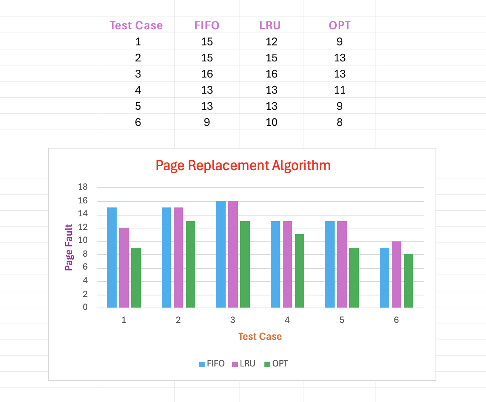

# Page Replacement Algorithm

## Page Replacement Algorithm Result:

**FIFO Replacement Algorithm**

Test Case: FIFO Test Case 1 Page Fault: 15

Test Case: FIFO Test Case 2 Page Fault: 15 

Test Case: FIFO Test Case 3 Page Fault: 16 

Test Case: FIFO Test Case 4 [rss:15, npf:3] Page Fault: 13 

Test Case: FIFO Test Case 5 [rss:15, npf:5] Page Fault: 13 

Test Case: FIFO Test Case 6 [rss:15, npf:7] Page Fault: 9 

**LRU Replacement Algorithm**

Test Case: LRU Test Case 1 Page Fault: 12 

Test Case: LRU Test Case 2 Page Fault: 15 

Test Case: LRU Test Case 3 Page Fault: 16 

Test Case: LRU Test Case 4 [rss:15, npf:3] Page Fault: 13 

Test Case: LRU Test Case 5 [rss:15, npf:5] Page Fault: 13 

Test Case: LRU Test Case 6 [rss:15, npf:7] Page Fault: 10 

**Optimal Replacement Algorithm**

Test Case: OPT Test Case 1 Page Fault: 9 

Test Case: OPT Test Case 2 Page Fault: 13 

Test Case: OPT Test Case 3 Page Fault: 13 

Test Case: OPT Test Case 4 [rss:15, npf:3] Page Fault: 11 

Test Case: OPT Test Case 5 [rss:15, npf:5] Page Fault: 9 

Test Case: OPT Test Case 6 [rss:15, npf:7] Page Fault: 8 

