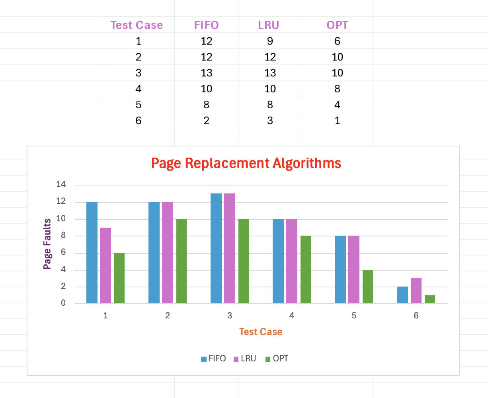

# Page Replacement Algorithm

Memory management lies at the core of efficient system operation, with page replacement algorithms playing a crucial role in optimizing memory usage. There are three prominent algorithms: FIFO (First-In-First-Out), LRU (Least Recently Used), and Optimal. Through a series of comprehensive test cases, an exploration into the details of these algorithms is conducted, aiming to understand their behavior across diverse page access patterns and memory configurations.  

Throughout the evaluation of page replacement algorithms, various test cases were conducted to assess their performance. Test Cases 1-3 featured different page string sequences but shared the same size of 20 strings and utilized 3 pages frames. Conversely, Test Cases 4-6 employed the same page string sequence input while varying the number of page frames, with Test Case 4 utilizing 3 frames, Test Case 5 with 5 frames, and Test Case 6 with 7 frames. Notably, despite identical page string sequences, the differing page frame configurations allowed us to observe how each algorithm adapted to varying memory constraints. The FIFO and LRU algorithms exhibited decreasing trends in page faults as the number of page frames increased in Test Cases 4-6. However, the Optimal Replacement Algorithm consistently outperformed both FIFO and LRU across all test cases, showcasing its effectiveness in minimizing page faults.  

Additionally, considering the runtime complexities, while FIFO page replacement algorithm has a linear complexity of O(n), LRU and Optimal page replacement algorithm exhibit quadratic complexities of O(n^2). Despite its higher computational complexity, Optimal page replacement algorithm's ability to make eviction decisions based on future page accesses underscores its suitability for scenarios where optimal performance is crucial, even with the need for future knowledge. 

The evaluation demonstrates the varying effectiveness of FIFO, LRU, and Optimal page replacement algorithms across different test cases. While FIFO and LRU page replacement algorithm exhibit performance improvements with increased page frames, Optimal page replacement algorithm consistently outperforms them by minimizing page faults. Despite its higher computational complexity, Optimal page replacement algorithm's ability to anticipate future page accesses underscores its suitability for scenarios where optimal performance is crucial. 

Overall, the evaluation of FIFO, LRU, and Optimal page replacement algorithms highlights their distinct performance characteristics and suitability for different memory management scenarios. While FIFO and LRU algorithms show improvements with increased page frames, Optimal consistently demonstrates superior performance in minimizing page faults. Despite its higher computational complexity, Optimal page replacement algorithm's predictive capabilities make it well-suited for scenarios where optimal performance is crucial. By understanding the strengths and limitations of each algorithm, system designers can make informed decisions to optimize memory usage and enhance overall system efficiency
 

## Page Replacement Algorithm Result:

**FIFO Replacement Algorithm**

Test Case: FIFO Test Case 1 Page Fault: 12

Test Case: FIFO Test Case 2 Page Fault: 12 

Test Case: FIFO Test Case 3 Page Fault: 13 

Test Case: FIFO Test Case 4 [rss:15, npf:3] Page Fault: 10 

Test Case: FIFO Test Case 5 [rss:15, npf:5] Page Fault: 8 

Test Case: FIFO Test Case 6 [rss:15, npf:7] Page Fault: 2 

**LRU Replacement Algorithm**

Test Case: LRU Test Case 1 Page Fault: 9 

Test Case: LRU Test Case 2 Page Fault: 12 

Test Case: LRU Test Case 3 Page Fault: 13 

Test Case: LRU Test Case 4 [rss:15, npf:3] Page Fault: 10 

Test Case: LRU Test Case 5 [rss:15, npf:5] Page Fault: 8 

Test Case: LRU Test Case 6 [rss:15, npf:7] Page Fault: 3 

**Optimal Replacement Algorithm**

Test Case: OPT Test Case 1 Page Fault: 6 

Test Case: OPT Test Case 2 Page Fault: 10 

Test Case: OPT Test Case 3 Page Fault: 10 

Test Case: OPT Test Case 4 [rss:15, npf:3] Page Fault: 8 

Test Case: OPT Test Case 5 [rss:15, npf:5] Page Fault: 4 

Test Case: OPT Test Case 6 [rss:15, npf:7] Page Fault: 1 

